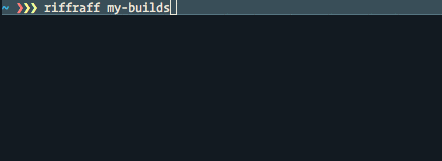

# riffraff



A commandline interface for Jenkins jobs, which queries the current status of all matching jobs in parallel.

###

```
usage: riffraff [<flags>] <command> [<args> ...]

Flags:
      --help     Show context-sensitive help (also try --help-long and --help-man).
  -v, --verbose  Verbose mode. Print full job output
      --salt     Show failed salt states

Commands:
  help [<command>...]
    Show help.

  status [<regex>]
    Show the status of all matching jobs

  logs [<job>]
    Show the logs of a job

  queue [<regex>]
    Show the queue of all matching jobs

  nodes
    Show the status of all Jenkins nodes

  open [<regex>]
    Open a job in the browser
```

### Installation

```
go get github.com/mre/riffraff
```

...or download a static binary from the [releases page](https://github.com/mre/riffraff/releases).

### Getting started

You need to set the following environment variables:

```
export JENKINS_URL="http://example.com/"
export JENKINS_USER="username"
export JENKINS_PW="password"
```

You might want to put those into your `~/.bashrc`, `~/.zshrc` or equivalent.


### Usage

```
riffraff status jenkins-job-name
```

This will print the current status of all Jenkins jobs matching the given pattern (`jenkins-job-name` in this case).
You can use any regular expression for that, e.g.:

```
riffraff status "^application-.*-unittests$"
```

You can get the full output of each last job matching the pattern with 

```
riffraff status -v "^application-.*-unittests$"
```

### OBTW

The tool is named after the [butler from the Rocky Horror Picture Show](https://en.wikipedia.org/wiki/The_Rocky_Horror_Picture_Show:_Let%27s_Do_the_Time_Warp_Again), and not the rapper.
